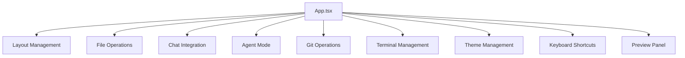
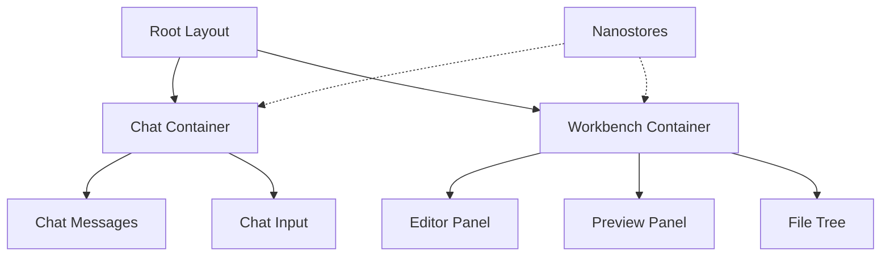
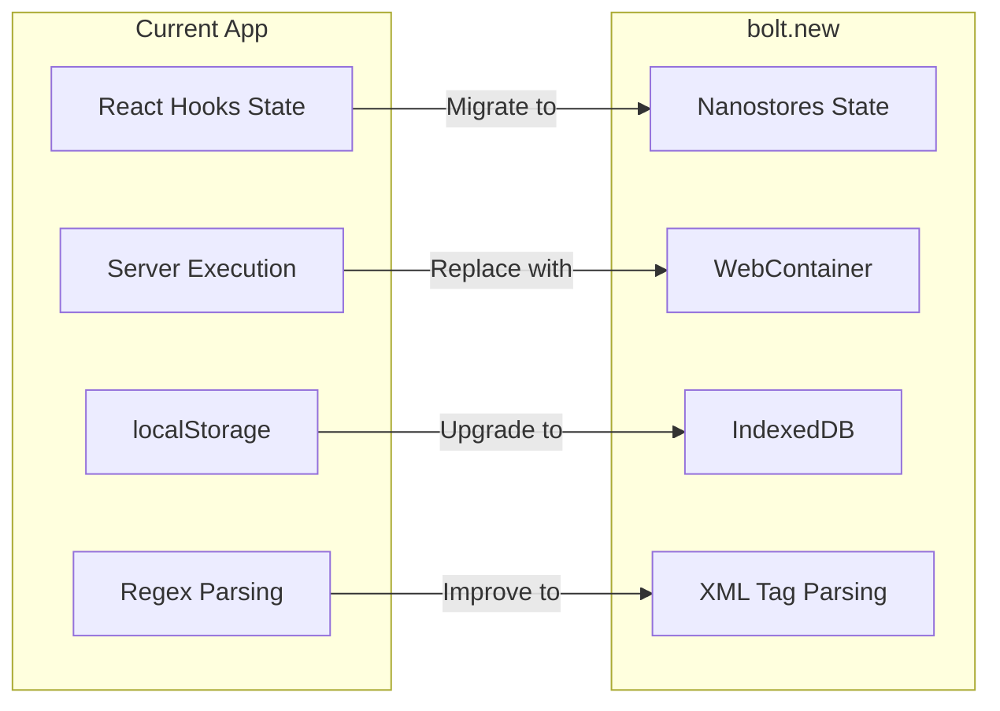

# Architecture Comparison Report: AI Code Studio Pro vs bolt.new

## Executive Summary

This report provides a detailed comparison between **AI Code Studio Pro** (the current application) and **bolt.new** (the reference architecture). The analysis reveals significant architectural differences in framework choice, state management, runtime environment, and AI integration patterns.

### Key Findings

| Aspect | AI Code Studio Pro | bolt.new |
|--------|-------------------|----------|
| **Framework** | Vite + Express (SPA) | Remix v2.10 (Full-stack React) |
| **State Management** | React hooks + useState | Nanostores (atomic state) |
| **Runtime** | Server-side Node.js (child_process) | WebContainer API (browser-based) |
| **AI Provider** | Alibaba Qwen3 Coder | Anthropic Claude |
| **Persistence** | localStorage | IndexedDB + localStorage |
| **Styling** | Tailwind CSS 4 | UnoCSS + SCSS + CSS Modules |
| **UI Components** | Custom + shadcn/ui | Radix UI + custom |

---

## 1. Technology Stack Comparison

### 1.1 Frontend Framework

#### AI Code Studio Pro
```
- React 19.0.0
- TypeScript 5.8.2
- Vite 6.2.0 (build tool)
- Express.js 4.21.2 (backend server)
```

#### bolt.new
```
- Remix v2.10 (React full-stack framework)
- TypeScript 5.5
- Vite 5.3 (bundled with Remix)
- Cloudflare Pages/Workers (deployment)
```

**Analysis:** The current app uses a traditional SPA architecture with a separate Express backend, while bolt.new uses Remix which provides:
- Server-side rendering (SSR) capabilities
- Built-in data loading patterns (loaders/actions)
- Progressive enhancement support
- Edge deployment optimization

### 1.2 State Management

#### AI Code Studio Pro
- Uses React's built-in `useState` hooks
- Custom hooks pattern: [`useFiles`](src/hooks/useFiles.ts:19), [`useChat`](src/hooks/useChat.ts:11), [`useAgent`](src/hooks/useAgent.ts:18), [`useGit`](src/hooks/useGit.ts)
- State passed via props drilling
- No centralized state store

#### bolt.new
- Uses **Nanostores** for atomic state management
- Dedicated stores: `chatStore`, `workbenchStore`, `themeStore`, `filesStore`
- Fine-grained reactivity
- State persistence built-in

**Gap:** The current app lacks a centralized state management solution, leading to:
- Prop drilling through component hierarchy
- Complex dependency chains between hooks
- Difficulty implementing cross-cutting concerns
- No atomic updates for derived state

### 1.3 Code Editor

#### AI Code Studio Pro
```typescript
// Uses @uiw/react-codemirror wrapper
import CodeMirror from '@uiw/react-codemirror';
import { javascript } from '@codemirror/lang-javascript';
import { oneDark } from '@codemirror/theme-one-dark';
```

#### bolt.new
- Direct CodeMirror 6 integration
- Custom editor extensions
- Streaming code updates from AI

**Comparison:** Both use CodeMirror 6, but bolt.new has deeper integration with AI streaming for real-time code generation visualization.

### 1.4 Terminal Implementation

#### AI Code Studio Pro
```typescript
// WebSocket-based terminal
const terminalServer = new WebSocketServer({ noServer: true });
// Uses xterm.js with @xterm/addon-fit
```

#### bolt.new
- Uses xterm.js
- Integrated with WebContainer for browser-based execution
- No server-side process management needed

**Key Difference:** The current app requires server-side process spawning, while bolt.new runs everything in the browser via WebContainer.

---

## 2. Architecture Analysis

### 2.1 Application Structure

#### AI Code Studio Pro Structure
```
src/
├── App.tsx              # Monolithic main component (~900+ lines)
├── components/          # 18 component files
├── hooks/               # 6 custom hooks
├── services/            # API layer (api.ts)
├── types/               # TypeScript definitions
├── constants/           # App constants
├── utils/               # Utility functions
└── themes/              # Theme configuration

server.ts                # Main server file (~1000+ lines)
server/routes/           # Route modules (ai, files, git)
server/services/         # Server services
server/utils/            # Server utilities
```

#### bolt.new Structure
```
app/
├── routes/              # Remix file-based routing
├── components/
│   ├── chat/            # Chat-specific components
│   ├── workbench/       # Editor/preview components
│   └── ui/              # Shared UI components
├── lib/
│   ├── stores/          # Nanostores state
│   ├── persistence/     # IndexedDB layer
│   └── runtime/         # WebContainer integration
└── styles/              # SCSS/CSS Modules
```

**Analysis:** The current app has a flatter structure with a monolithic [`App.tsx`](src/App.tsx:65) component, while bolt.new follows domain-driven organization with clear separation of concerns.

### 2.2 Component Architecture

#### AI Code Studio Pro - Main Component Issues

The [`App.tsx`](src/App.tsx:65) component handles too many responsibilities:



This leads to:
- Complex state dependencies
- Difficult testing
- Hard to reason about data flow
- Prop drilling to child components

#### bolt.new Component Pattern



Components subscribe to stores directly, eliminating prop drilling.

### 2.3 Server Architecture

#### AI Code Studio Pro - Monolithic Server

The [`server.ts`](server.ts:1) file contains:
- Express app setup
- Vite dev server integration
- WebSocket server for terminal
- All API routes inline
- Process management
- AI proxy endpoints
- Git operations
- File system operations

**Issues:**
- Single file with 1000+ lines
- Mixed concerns
- Difficult to test individual routes
- No clear separation between middleware and handlers

#### bolt.new - Remix API Routes

- File-based API routing
- Built-in loader/action pattern
- Edge-compatible handlers
- Streaming responses via Remix utilities

---

## 3. Runtime Environment Comparison

### 3.1 Code Execution Model

#### AI Code Studio Pro - Server-Side Execution

```typescript
// server.ts - Process spawning
function spawnWorkspaceProcess(command: string, cwd: string): ChildProcessWithoutNullStreams {
  const shell = IS_WINDOWS ? 'cmd' : 'sh';
  const shellArgs = IS_WINDOWS ? ['/c', command] : ['-c', command];
  return spawn(shell, shellArgs, { cwd, ... });
}
```

**Characteristics:**
- Requires Node.js runtime on server
- Process management overhead
- Security considerations for arbitrary code execution
- Platform-specific handling (Windows vs Unix)
- Resource cleanup complexity

#### bolt.new - WebContainer (Browser-Based)

```typescript
// WebContainer integration
import { WebContainer } from '@webcontainer/api';

const webcontainer = await WebContainer.boot();
await webcontainer.mount(files);
await webcontainer.spawn('npm', ['install']);
```

**Characteristics:**
- Runs entirely in browser
- No server-side execution needed
- SharedArrayBuffer requirement
- Sandboxed by default
- Instant startup after initial load

### 3.2 Preview System

#### AI Code Studio Pro
```typescript
// Preview via server proxy
app.get("/preview/*", (req, res) => {
  const filePath = req.params[0] || "index.html";
  const fullPath = safePath(filePath);
  // Serves from project-workspace/
});
```

#### bolt.new
- WebContainer serves files directly
- iframe-based preview
- Hot module replacement built-in

---

## 4. AI Integration Comparison

### 4.1 AI Provider Integration

#### AI Code Studio Pro - Alibaba Qwen

```typescript
// server.ts - AI proxy
const AI_BASE_URL = process.env.VITE_ALIBABA_BASE_URL || 
  'https://coding-intl.dashscope.aliyuncs.com/v1';

app.post("/api/chat", async (req, res) => {
  const response = await fetch(`${AI_BASE_URL}/chat/completions`, {
    method: 'POST',
    headers: {
      'Authorization': `Bearer ${apiKey}`
    },
    body: JSON.stringify({ model, messages, stream: true })
  });
  // SSE streaming...
});
```

**Features:**
- Streaming chat via SSE
- Multiple AI endpoints (analyze, refactor, debug, etc.)
- Persona detection system
- Agent memory persistence

#### bolt.new - Anthropic Claude

```typescript
// Uses @ai-sdk/anthropic
import { Anthropic } from '@anthropic-ai/sdk';

const stream = await anthropic.messages.stream({
  model: 'claude-3-5-sonnet-20241022',
  messages,
  system: systemPrompt,
});
```

**Features:**
- Native streaming SDK
- Tool use for file operations
- Structured output parsing
- XML-like tag parsing for actions

### 4.2 Agent Mode Implementation

#### AI Code Studio Pro

The [`useAgent`](src/hooks/useAgent.ts:18) hook implements:
- Agent and Plan modes
- Event-based streaming via SSE
- File operation events
- Command execution tracking
- Server startup detection

```typescript
// Agent event types
interface AgentEvent {
  type: 'plan' | 'text' | 'file_created' | 'file_edited' | 
        'file_deleted' | 'command_start' | 'command_output' | 
        'tool_call' | 'server_started' | 'error' | 'done';
  // ...
}
```

#### bolt.new

- Uses AI SDK tool calling
- Structured action system
- Streaming artifact updates
- Built-in code parsing

### 4.3 Message Parsing

#### AI Code Studio Pro - Regex-Based

```typescript
// useChat.ts - Code block extraction
const codeBlockRegex = /```(?:(\w+):([^\n`]+)|([^\s`\n]+\.\w+))?\n([\s\S]*?)```/g;
const filenameCommentRegex = /^(?:\/\/|#|\/\*)\s*([\w.\-/]+\.\w+)/;
```

#### bolt.new - XML-Like Tags

```xml
<artifact>
  <action type="file" path="src/App.tsx">
    // file content
  </action>
</artifact>
```

**Gap:** The current regex-based parsing is less robust than structured XML parsing for complex multi-file operations.

---

## 5. State Persistence Comparison

### 5.1 AI Code Studio Pro

```typescript
// utils/persistence.ts
export async function loadUiState(): Promise<UiStateSnapshot | null> {
  const raw = localStorage.getItem(UI_STATE_KEY);
  return raw ? JSON.parse(raw) : null;
}

export async function saveUiState(snapshot: Partial<UiStateSnapshot>): Promise<void> {
  const current = await loadUiState() || {};
  const merged = { ...current, ...snapshot };
  localStorage.setItem(UI_STATE_KEY, JSON.stringify(merged));
}
```

**Limitations:**
- localStorage size limit (~5-10MB)
- Synchronous blocking operations
- No indexing for complex queries
- Chat history can grow large

### 5.2 bolt.new

```typescript
// IndexedDB for chat history
const db = await openDB('bolt-db', 1, {
  upgrade(db) {
    db.createObjectStore('chats', { keyPath: 'id' });
    db.createObjectStore('files', { keyPath: 'path' });
  },
});

// Async operations
await db.put('chats', chat);
const chats = await db.getAll('chats');
```

**Advantages:**
- Larger storage capacity
- Async non-blocking operations
- Indexed queries
- Better for chat history persistence

---

## 6. Gap Analysis

### 6.1 Critical Missing Features

| Feature | Priority | Description |
|---------|----------|-------------|
| WebContainer Integration | High | Browser-based Node.js runtime eliminates server dependency |
| Centralized State Management | High | Nanostores or similar for predictable state updates |
| IndexedDB Persistence | Medium | Better storage for chat history and large projects |
| Remix Framework | Medium | SSR, routing, and edge deployment benefits |
| Structured AI Output Parsing | Medium | XML-like tags for reliable file operations |

### 6.2 Architecture Improvements Needed

1. **Component Decomposition**
   - Break down [`App.tsx`](src/App.tsx:65) into smaller, focused components
   - Implement container/presenter pattern
   - Use composition over prop drilling

2. **Server Refactoring**
   - Split [`server.ts`](server.ts:1) into modular route files
   - Move business logic to services
   - Implement proper middleware chain

3. **State Management Migration**
   - Introduce Nanostores or Zustand
   - Create domain-specific stores
   - Implement derived state patterns

4. **AI Integration Enhancement**
   - Implement tool calling pattern
   - Add structured output parsing
   - Improve streaming UX

### 6.3 Missing bolt.new Features



---

## 7. Recommendations

### 7.1 Short-Term Improvements

1. **Refactor App.tsx**
   - Extract layout components
   - Create context providers for cross-cutting state
   - Reduce component complexity

2. **Add State Management**
   - Install Nanostores: `npm install nanostores @nanostores/react`
   - Create stores for: files, chat, editor, theme
   - Migrate useState to stores incrementally

3. **Improve Server Structure**
   - Move remaining routes from [`server.ts`](server.ts:1) to [`server/routes/`](server/routes/)
   - Create service layer for AI operations
   - Add proper error handling middleware

### 7.2 Medium-Term Improvements

1. **Migrate to IndexedDB**
   - Use idb or Dexie.js for chat history
   - Implement automatic cleanup of old messages
   - Add export/import functionality

2. **Enhance AI Integration**
   - Implement streaming code highlighting
   - Add diff visualization for code changes
   - Support multiple AI providers

3. **Improve Terminal Integration**
   - Better process management UI
   - Support for multiple terminal sessions
   - Command history and autocomplete

### 7.3 Long-Term Considerations

1. **Evaluate Remix Migration**
   - Benefits: SSR, edge deployment, streaming
   - Costs: Significant refactor, learning curve
   - Alternative: Keep Vite + Express, improve incrementally

2. **WebContainer Evaluation**
   - Requires HTTPS and SharedArrayBuffer headers
   - Browser support limitations
   - May not suit all deployment scenarios

---

## 8. Component Mapping

### 8.1 Current Components vs bolt.new Equivalents

| AI Code Studio Pro | bolt.new Equivalent | Notes |
|-------------------|---------------------|-------|
| [`ChatPanel.tsx`](src/components/ChatPanel.tsx:82) | `Chat.tsx` + `BaseChat.tsx` | Similar functionality, different structure |
| [`FileExplorer.tsx`](src/components/FileExplorer.tsx) | `FileTree.tsx` | Tree view implementation |
| [`TerminalPanel.tsx`](src/components/TerminalPanel.tsx) | `Terminal.tsx` | Both use xterm.js |
| [`PreviewPanel.tsx`](src/components/PreviewPanel.tsx) | `Preview.tsx` | iframe-based preview |
| [`GitPanel.tsx`](src/components/GitPanel.tsx) | N/A | bolt.new uses GitHub integration |
| [`AIIntelPanel.tsx`](src/components/AIIntelPanel.tsx) | N/A | Unique feature |
| [`MCPServersPanel.tsx`](src/components/MCPServersPanel.tsx) | N/A | Unique MCP integration |
| [`DashboardPanel.tsx`](src/components/DashboardPanel.tsx) | N/A | Unique dashboard feature |
| [`CommandPalette.tsx`](src/components/CommandPalette.tsx) | N/A | VS Code-style command palette |
| [`GlobalSearchModal.tsx`](src/components/GlobalSearchModal.tsx) | N/A | Global search feature |

### 8.2 Unique Features in AI Code Studio Pro

1. **MCP Server Integration** - Model Context Protocol support for external tools
2. **AI Intel Panel** - Code intelligence features
3. **Dashboard** - Project overview and metrics
4. **Command Palette** - Quick action access
5. **Global Search** - Cross-file search functionality
6. **Multiple AI Endpoints** - Analyze, refactor, debug, optimize, explain

---

## 9. Conclusion

AI Code Studio Pro is a feature-rich browser-based IDE with several unique capabilities not found in bolt.new. However, the architecture shows signs of organic growth that could benefit from:

1. **State Management Modernization** - Moving from useState hooks to a centralized store
2. **Component Decomposition** - Breaking down the monolithic App.tsx
3. **Server Modularization** - Completing the migration to route modules
4. **Persistence Upgrade** - Moving from localStorage to IndexedDB

The bolt.new architecture provides valuable patterns for:
- Atomic state management with Nanostores
- Browser-based execution with WebContainer
- Structured AI output parsing
- Component organization by domain

A hybrid approach that preserves the unique features of AI Code Studio Pro while adopting proven patterns from bolt.new would yield the best results.

---

*Report generated: 2026-03-24*
*Analyzed files: 25+ source files across frontend and backend*