# Implementation Task List

## Overview

This document extracts specific implementation tasks from the improvement roadmap and organizes them by priority, effort, and sprint assignment. Tasks are prioritized using MoSCoW method (Must have, Should have, Could have, Won't have) and grouped into 2-week sprints.

---

## Sprint 1: Foundation - State Management (Week 1-2)

### Must Have

- [ ] **T1.1: Install Nanostores Dependencies**
  - **Priority**: P0 (Critical)
  - **Effort**: Small
  - **Dependencies**: None
  - **Acceptance Criteria**:
    - [ ] `nanostores` and `@nanostores/react` added to package.json
    - [ ] Dependencies installed successfully
    - [ ] No version conflicts with existing dependencies
  - **Files to Modify**: `package.json`
  - **Description**: Add Nanostores packages for atomic state management. Required version: nanostores ^0.10.0, @nanostores/react ^0.7.0

- [ ] **T1.2: Create filesStore**
  - **Priority**: P0 (Critical)
  - **Effort**: Medium
  - **Dependencies**: T1.1
  - **Acceptance Criteria**:
    - [ ] `src/stores/filesStore.ts` created
    - [ ] Exports: `activeFileId`, `openTabIds`, `files` map
    - [ ] Computed values: `activeFile`, `openFiles`
    - [ ] Actions: `setActiveFile`, `openFile`, `closeFile`, `updateFileContent`
    - [ ] Unit tests pass
  - **Files to Create**: `src/stores/filesStore.ts`, `src/test/stores/filesStore.test.ts`
  - **Description**: Create atomic store for file state management, replacing useState in App.tsx

- [ ] **T1.3: Create chatStore**
  - **Priority**: P0 (Critical)
  - **Effort**: Medium
  - **Dependencies**: T1.1
  - **Acceptance Criteria**:
    - [ ] `src/stores/chatStore.ts` created
    - [ ] Exports: `messages`, `isGenerating`, `currentProvider`
    - [ ] Actions: `addMessage`, `clearMessages`, `setGenerating`
    - [ ] Unit tests pass
  - **Files to Create**: `src/stores/chatStore.ts`, `src/test/stores/chatStore.test.ts`
  - **Description**: Create store for chat state including message history and AI generation status

- [ ] **T1.4: Create editorStore**
  - **Priority**: P0 (Critical)
  - **Effort**: Small
  - **Dependencies**: T1.1
  - **Acceptance Criteria**:
    - [ ] `src/stores/editorStore.ts` created
    - [ ] Exports: `editorContent`, `cursorPosition`, `editorTheme`
    - [ ] Actions: `updateContent`, `setCursorPosition`
    - [ ] Unit tests pass
  - **Files to Create**: `src/stores/editorStore.ts`, `src/test/stores/editorStore.test.ts`
  - **Description**: Create store for CodeMirror editor state

- [ ] **T1.5: Create themeStore**
  - **Priority**: P1 (High)
  - **Effort**: Small
  - **Dependencies**: T1.1
  - **Acceptance Criteria**:
    - [ ] `src/stores/themeStore.ts` created
    - [ ] Exports: `currentTheme`, `customThemes`
    - [ ] Persistence integration for theme preference
    - [ ] Actions: `setTheme`, `addCustomTheme`
    - [ ] Unit tests pass
  - **Files to Create**: `src/stores/themeStore.ts`, `src/test/stores/themeStore.test.ts`
  - **Description**: Create store for theme management with persistence

- [ ] **T1.6: Create agentStore**
  - **Priority**: P1 (High)
  - **Effort**: Medium
  - **Dependencies**: T1.1
  - **Acceptance Criteria**:
    - [ ] `src/stores/agentStore.ts` created
    - [ ] Exports: `isAgentMode`, `agentPlan`, `agentStep`, `agentMemory`
    - [ ] Actions: `toggleAgentMode`, `updatePlan`, `advanceStep`
    - [ ] Unit tests pass
  - **Files to Create**: `src/stores/agentStore.ts`, `src/test/stores/agentStore.test.ts`
  - **Description**: Create store for AI agent mode state and planning

- [ ] **T1.7: Create uiStore**
  - **Priority**: P1 (High)
  - **Effort**: Small
  - **Dependencies**: T1.1
  - **Acceptance Criteria**:
    - [ ] `src/stores/uiStore.ts` created
    - [ ] Exports: `leftPanel`, `rightPanel`, `activeLeftTab`, `activeRightTab`
    - [ ] Actions: `togglePanel`, `setActiveTab`
    - [ ] Unit tests pass
  - **Files to Create**: `src/stores/uiStore.ts`, `src/test/stores/uiStore.test.ts`
  - **Description**: Create store for UI panel state management

### Should Have

- [ ] **T1.8: Create Store Persistence Utility**
  - **Priority**: P1 (High)
  - **Effort**: Medium
  - **Dependencies**: T1.2, T1.3, T1.4, T1.5, T1.6, T1.7
  - **Acceptance Criteria**:
    - [ ] `src/stores/persistence.ts` created
    - [ ] `persistentAtom` factory function implemented
    - [ ] localStorage sync working
    - [ ] Migration from existing localStorage keys
    - [ ] Unit tests pass
  - **Files to Create**: `src/stores/persistence.ts`, `src/test/stores/persistence.test.ts`
  - **Description**: Create persistence layer for stores with localStorage sync

- [ ] **T1.9: Create Store Index Export**
  - **Priority**: P2 (Medium)
  - **Effort**: Small
  - **Dependencies**: T1.2-T1.7
  - **Acceptance Criteria**:
    - [ ] `src/stores/index.ts` created
    - [ ] All stores re-exported from single entry point
    - [ ] TypeScript types exported
  - **Files to Create**: `src/stores/index.ts`
  - **Description**: Create barrel export for all stores

---

## Sprint 2: Foundation - Component Decomposition (Week 3-4)

### Must Have

- [ ] **T2.1: Create LayoutContext**
  - **Priority**: P0 (Critical)
  - **Effort**: Medium
  - **Dependencies**: T1.7 (uiStore)
  - **Acceptance Criteria**:
    - [ ] `src/contexts/LayoutContext.tsx` created
    - [ ] Provides panel visibility state
    - [ ] Provides sidebar width state
    - [ ] Integrates with uiStore
    - [ ] Unit tests pass
  - **Files to Create**: `src/contexts/LayoutContext.tsx`, `src/test/contexts/LayoutContext.test.tsx`
  - **Description**: Create context for layout state management

- [ ] **T2.2: Create FileContext**
  - **Priority**: P0 (Critical)
  - **Effort**: Medium
  - **Dependencies**: T1.2 (filesStore)
  - **Acceptance Criteria**:
    - [ ] `src/contexts/FileContext.tsx` created
    - [ ] Wraps filesStore with context API
    - [ ] Provides file CRUD operations
    - [ ] Provides tab management
    - [ ] Unit tests pass
  - **Files to Create**: `src/contexts/FileContext.tsx`, `src/test/contexts/FileContext.test.tsx`
  - **Description**: Create context wrapping filesStore for backward compatibility

- [ ] **T2.3: Create ChatContext**
  - **Priority**: P0 (Critical)
  - **Effort**: Medium
  - **Dependencies**: T1.3 (chatStore)
  - **Acceptance Criteria**:
    - [ ] `src/contexts/ChatContext.tsx` created
    - [ ] Wraps chatStore with context API
    - [ ] Provides message operations
    - [ ] Provides AI generation controls
    - [ ] Unit tests pass
  - **Files to Create**: `src/contexts/ChatContext.tsx`, `src/test/contexts/ChatContext.test.tsx`
  - **Description**: Create context wrapping chatStore for backward compatibility

- [ ] **T2.4: Extract ActivityBar Component**
  - **Priority**: P1 (High)
  - **Effort**: Medium
  - **Dependencies**: T2.1
  - **Acceptance Criteria**:
    - [ ] `src/components/layout/ActivityBar.tsx` created
    - [ ] Contains left sidebar navigation icons
    - [ ] Subscribes to uiStore for active tab
    - [ ] Keyboard accessible
    - [ ] Unit tests pass
  - **Files to Create**: `src/components/layout/ActivityBar.tsx`, `src/test/components/ActivityBar.test.tsx`
  - **Description**: Extract activity bar from App.tsx into standalone component

- [ ] **T2.5: Extract LeftSidebar Component**
  - **Priority**: P1 (High)
  - **Effort**: Medium
  - **Dependencies**: T2.1, T2.4
  - **Acceptance Criteria**:
    - [ ] `src/components/layout/LeftSidebar.tsx` created
    - [ ] Contains FileExplorer, SearchPanel, GitPanel, SymbolOutline, AIIntelPanel, MCPServersPanel, DashboardPanel
    - [ ] Panel switching logic extracted
    - [ ] Unit tests pass
  - **Files to Create**: `src/components/layout/LeftSidebar.tsx`, `src/test/components/LeftSidebar.test.tsx`
  - **Description**: Extract left sidebar container from App.tsx

- [ ] **T2.6: Extract EditorPanel Component**
  - **Priority**: P1 (High)
  - **Effort**: Large
  - **Dependencies**: T2.2
  - **Acceptance Criteria**:
    - [ ] `src/components/editor/EditorPanel.tsx` created
    - [ ] `src/components/editor/EditorTabs.tsx` created
    - [ ] `src/components/editor/EditorContent.tsx` created
    - [ ] Tab management extracted
    - [ ] CodeMirror integration preserved
    - [ ] Unit tests pass
  - **Files to Create**: `src/components/editor/EditorPanel.tsx`, `src/components/editor/EditorTabs.tsx`, `src/components/editor/EditorContent.tsx`
  - **Description**: Extract editor panel with tabs and content from App.tsx

- [ ] **T2.7: Extract RightSidebar Component**
  - **Priority**: P1 (High)
  - **Effort**: Medium
  - **Dependencies**: T2.1, T2.3
  - **Acceptance Criteria**:
    - [ ] `src/components/layout/RightSidebar.tsx` created
    - [ ] Contains ChatPanel and TerminalPanel
    - [ ] Panel switching logic extracted
    - [ ] Unit tests pass
  - **Files to Create**: `src/components/layout/RightSidebar.tsx`, `src/test/components/RightSidebar.test.tsx`
  - **Description**: Extract right sidebar container from App.tsx

### Should Have

- [ ] **T2.8: Extract KeyboardShortcuts Component**
  - **Priority**: P1 (High)
  - **Effort**: Medium
  - **Dependencies**: T2.1, T2.2, T2.3
  - **Acceptance Criteria**:
    - [ ] `src/components/KeyboardShortcuts.tsx` created
    - [ ] All global keyboard handlers extracted
    - [ ] Uses react-hotkeys-hook or native listeners
    - [ ] Shortcuts documented
    - [ ] Unit tests pass
  - **Files to Create**: `src/components/KeyboardShortcuts.tsx`, `src/test/components/KeyboardShortcuts.test.tsx`
  - **Description**: Extract global keyboard shortcut handling from App.tsx

- [ ] **T2.9: Extract ModalManager Component**
  - **Priority**: P2 (Medium)
  - **Effort**: Medium
  - **Dependencies**: None
  - **Acceptance Criteria**:
    - [ ] `src/components/ModalManager.tsx` created
    - [ ] SettingsModal, ShortcutsModal, ThemeSelector extracted
    - [ ] Modal state management centralized
    - [ ] Unit tests pass
  - **Files to Create**: `src/components/ModalManager.tsx`, `src/test/components/ModalManager.test.tsx`
  - **Description**: Extract modal management from App.tsx

- [ ] **T2.10: Refactor App.tsx**
  - **Priority**: P0 (Critical)
  - **Effort**: Large
  - **Dependencies**: T2.1-T2.9
  - **Acceptance Criteria**:
    - [ ] App.tsx reduced to < 200 lines
    - [ ] Only layout composition remains
    - [ ] All state moved to stores
    - [ ] All tests pass
    - [ ] No functionality regression
  - **Files to Modify**: `src/App.tsx`
  - **Description**: Refactor App.tsx to use new components and stores, reducing complexity

---

## Sprint 3: Foundation - Server Modularization (Week 5-6)

### Must Have

- [ ] **T3.1: Create ProcessService**
  - **Priority**: P0 (Critical)
  - **Effort**: Medium
  - **Dependencies**: None
  - **Acceptance Criteria**:
    - [ ] `server/services/processService.ts` created
    - [ ] Process spawning logic extracted
    - [ ] Process cleanup handling
    - [ ] Unit tests pass
  - **Files to Create**: `server/services/processService.ts`, `src/test/server/processService.test.ts`
  - **Description**: Extract process management logic from server.ts

- [ ] **T3.2: Extract Chat Routes**
  - **Priority**: P1 (High)
  - **Effort**: Medium
  - **Dependencies**: None
  - **Acceptance Criteria**:
    - [ ] `server/routes/chat.ts` created
    - [ ] Chat streaming endpoints extracted
    - [ ] SSE handling preserved
    - [ ] Unit tests pass
  - **Files to Create**: `server/routes/chat.ts`, `src/test/server/routes/chat.test.ts`
  - **Description**: Extract chat-related routes from server.ts

- [ ] **T3.3: Extract Agent Routes**
  - **Priority**: P1 (High)
  - **Effort**: Medium
  - **Dependencies**: T3.1
  - **Acceptance Criteria**:
    - [ ] `server/routes/agent.ts` created
    - [ ] Agent mode endpoints extracted
    - [ ] SSE handling preserved
    - [ ] Unit tests pass
  - **Files to Create**: `server/routes/agent.ts`, `src/test/server/routes/agent.test.ts`
  - **Description**: Extract agent-related routes from server.ts

- [ ] **T3.4: Extract Preview Routes**
  - **Priority**: P1 (High)
  - **Effort**: Small
  - **Dependencies**: None
  - **Acceptance Criteria**:
    - [ ] `server/routes/preview.ts` created
    - [ ] Preview server endpoints extracted
    - [ ] Port management preserved
    - [ ] Unit tests pass
  - **Files to Create**: `server/routes/preview.ts`, `src/test/server/routes/preview.test.ts`
  - **Description**: Extract preview-related routes from server.ts

- [ ] **T3.5: Create Terminal WebSocket Handler**
  - **Priority**: P1 (High)
  - **Effort**: Medium
  - **Dependencies**: T3.1
  - **Acceptance Criteria**:
    - [ ] `server/routes/terminal.ts` created
    - [ ] WebSocket handling extracted
    - [ ] PTY integration preserved
    - [ ] Unit tests pass
  - **Files to Create**: `server/routes/terminal.ts`, `src/test/server/routes/terminal.test.ts`
  - **Description**: Extract terminal WebSocket handling from server.ts

### Should Have

- [ ] **T3.6: Create Error Handling Middleware**
  - **Priority**: P1 (High)
  - **Effort**: Small
  - **Dependencies**: None
  - **Acceptance Criteria**:
    - [ ] `server/middleware/errorHandler.ts` created
    - [ ] Global error handling implemented
    - [ ] Proper HTTP status codes
    - [ ] Logging integration
    - [ ] Unit tests pass
  - **Files to Create**: `server/middleware/errorHandler.ts`, `src/test/server/middleware/errorHandler.test.ts`
  - **Description**: Create centralized error handling middleware

- [ ] **T3.7: Create Validation Middleware**
  - **Priority**: P2 (Medium)
  - **Effort**: Medium
  - **Dependencies**: None
  - **Acceptance Criteria**:
    - [ ] `server/middleware/validation.ts` created
    - [ ] Request validation using Zod or similar
    - [ ] Reusable validation schemas
    - [ ] Unit tests pass
  - **Files to Create**: `server/middleware/validation.ts`, `src/test/server/middleware/validation.test.ts`
  - **Description**: Create request validation middleware

- [ ] **T3.8: Refactor server.ts**
  - **Priority**: P0 (Critical)
  - **Effort**: Large
  - **Dependencies**: T3.1-T3.7
  - **Acceptance Criteria**:
    - [ ] server.ts reduced to < 200 lines
    - [ ] Only app setup and route mounting
    - [ ] All routes modularized
    - [ ] All tests pass
    - [ ] No functionality regression
  - **Files to Modify**: `server.ts`
  - **Description**: Refactor server.ts to use modular routes and services

---

## Sprint 4: Enhancement - IndexedDB Persistence (Week 7-8)

### Must Have

- [ ] **T4.1: Install Dexie.js Dependencies**
  - **Priority**: P0 (Critical)
  - **Effort**: Small
  - **Dependencies**: None
  - **Acceptance Criteria**:
    - [ ] `dexie` and `dexie-react-hooks` added to package.json
    - [ ] Dependencies installed successfully
    - [ ] No version conflicts
  - **Files to Modify**: `package.json`
  - **Description**: Add Dexie.js for IndexedDB wrapper

- [ ] **T4.2: Create Database Schema**
  - **Priority**: P0 (Critical)
  - **Effort**: Medium
  - **Dependencies**: T4.1
  - **Acceptance Criteria**:
    - [ ] `src/lib/db.ts` created
    - [ ] Tables: chats, files, settings, agentMemory
    - [ ] Indexes defined for queries
    - [ ] TypeScript types exported
    - [ ] Unit tests pass
  - **Files to Create**: `src/lib/db.ts`, `src/test/lib/db.test.ts`
  - **Description**: Create IndexedDB schema with Dexie.js

- [ ] **T4.3: Create PersistenceService**
  - **Priority**: P0 (Critical)
  - **Effort**: Large
  - **Dependencies**: T4.2
  - **Acceptance Criteria**:
    - [ ] `src/services/persistenceService.ts` created
    - [ ] CRUD operations for all tables
    - [ ] Transaction support
    - [ ] Error handling
    - [ ] Unit tests pass
  - **Files to Create**: `src/services/persistenceService.ts`, `src/test/services/persistenceService.test.ts`
  - **Description**: Create service layer for IndexedDB operations

- [ ] **T4.4: Implement Chat History Persistence**
  - **Priority**: P1 (High)
  - **Effort**: Medium
  - **Dependencies**: T4.3, T1.3
  - **Acceptance Criteria**:
    - [ ] Chat messages persisted to IndexedDB
    - [ ] History loading on app start
    - [ ] Search by timestamp
    - [ ] Unit tests pass
  - **Files to Modify**: `src/stores/chatStore.ts`, `src/hooks/useChat.ts`
  - **Description**: Integrate chat persistence with chatStore

### Should Have

- [ ] **T4.5: Implement File Cache Persistence**
  - **Priority**: P2 (Medium)
  - **Effort**: Medium
  - **Dependencies**: T4.3, T1.2
  - **Acceptance Criteria**:
    - [ ] File content cached to IndexedDB
    - [ ] Offline file access
    - [ ] Cache invalidation strategy
    - [ ] Unit tests pass
  - **Files to Modify**: `src/stores/filesStore.ts`, `src/hooks/useFiles.ts`
  - **Description**: Integrate file caching with filesStore

- [ ] **T4.6: Create Migration Utilities**
  - **Priority**: P1 (High)
  - **Effort**: Medium
  - **Dependencies**: T4.3
  - **Acceptance Criteria**:
    - [ ] `src/utils/migration.ts` created
    - [ ] Migrate data from localStorage
    - [ ] Version tracking
    - [ ] Rollback capability
    - [ ] Unit tests pass
  - **Files to Create**: `src/utils/migration.ts`, `src/test/utils/migration.test.ts`
  - **Description**: Create utilities to migrate from localStorage to IndexedDB

- [ ] **T4.7: Add localStorage Fallback**
  - **Priority**: P2 (Medium)
  - **Effort**: Medium
  - **Dependencies**: T4.3
  - **Acceptance Criteria**:
    - [ ] Feature detection for IndexedDB
    - [ ] Graceful fallback to localStorage
    - [ ] User notification if storage limited
    - [ ] Unit tests pass
  - **Files to Modify**: `src/services/persistenceService.ts`
  - **Description**: Implement fallback for browsers without IndexedDB support

---

## Sprint 5: Enhancement - AI Streaming (Week 9-10)

### Must Have

- [ ] **T5.1: Create AIProviderService Abstraction**
  - **Priority**: P1 (High)
  - **Effort**: Large
  - **Dependencies**: None
  - **Acceptance Criteria**:
    - [ ] `server/services/aiProviderService.ts` created
    - [ ] Provider interface defined
    - [ ] QwenProvider implemented
    - [ ] Extensible for other providers
    - [ ] Unit tests pass
  - **Files to Create**: `server/services/aiProviderService.ts`, `src/test/server/aiProviderService.test.ts`
  - **Description**: Create abstraction layer for AI providers

- [ ] **T5.2: Implement XML Tag Parser**
  - **Priority**: P0 (Critical)
  - **Effort**: Medium
  - **Dependencies**: None
  - **Acceptance Criteria**:
    - [ ] `src/lib/ai-parser.ts` created
    - [ ] Parse file create/edit/delete tags
    - [ ] Parse command tags
    - [ ] Parse action tags
    - [ ] Unit tests with various AI outputs
  - **Files to Create**: `src/lib/ai-parser.ts`, `src/test/lib/ai-parser.test.ts`
  - **Description**: Create parser for XML-like tags in AI output

- [ ] **T5.3: Add Diff Visualization Component**
  - **Priority**: P1 (High)
  - **Effort**: Large
  - **Dependencies**: T5.2
  - **Acceptance Criteria**:
    - [ ] `src/components/DiffViewer.tsx` created
    - [ ] Side-by-side diff view
    - [ ] Syntax highlighting
    - [ ] Accept/reject changes
    - [ ] Unit tests pass
  - **Files to Create**: `src/components/DiffViewer.tsx`, `src/test/components/DiffViewer.test.tsx`
  - **Description**: Create component to visualize code diffs from AI suggestions

### Should Have

- [ ] **T5.4: Create Streaming Code Highlighter**
  - **Priority**: P2 (Medium)
  - **Effort**: Medium
  - **Dependencies**: None
  - **Acceptance Criteria**:
    - [ ] Real-time syntax highlighting during streaming
    - [ ] Language detection
    - [ ] Performance optimized
    - [ ] Unit tests pass
  - **Files to Create**: `src/lib/streamingHighlighter.ts`
  - **Description**: Create highlighter for streaming code output

- [ ] **T5.5: Add Multi-Provider Support**
  - **Priority**: P2 (Medium)
  - **Effort**: Large
  - **Dependencies**: T5.1
  - **Acceptance Criteria**:
    - [ ] ClaudeProvider implemented
    - [ ] GPTProvider implemented
    - [ ] Provider selection in UI
    - [ ] API key management
    - [ ] Unit tests pass
  - **Files to Modify**: `server/services/aiProviderService.ts`, `src/components/SettingsModal.tsx`
  - **Description**: Add support for multiple AI providers

- [ ] **T5.6: Implement Action Classifier**
  - **Priority**: P2 (Medium)
  - **Effort**: Medium
  - **Dependencies**: T5.2
  - **Acceptance Criteria**:
    - [ ] Classify AI output as file action, command, or text
    - [ ] Confidence scoring
    - [ ] Unit tests pass
  - **Files to Create**: `src/lib/actionClassifier.ts`, `src/test/lib/actionClassifier.test.ts`
  - **Description**: Classify AI output to determine appropriate action

- [ ] **T5.7: Add File Suggestion Detector**
  - **Priority**: P2 (Medium)
  - **Effort**: Small
  - **Dependencies**: T5.2
  - **Acceptance Criteria**:
    - [ ] Detect file references in AI output
    - [ ] Create clickable links
    - [ ] Unit tests pass
  - **Files to Create**: `src/lib/fileSuggestionDetector.ts`
  - **Description**: Detect and linkify file references in AI responses

---

## Sprint 6: Enhancement - Terminal (Week 11-12)

### Must Have

- [ ] **T6.1: Create TerminalManager Service**
  - **Priority**: P1 (High)
  - **Effort**: Large
  - **Dependencies**: T3.5
  - **Acceptance Criteria**:
    - [ ] `server/services/terminalManager.ts` created
    - [ ] Multi-session support
    - [ ] Session lifecycle management
    - [ ] Unit tests pass
  - **Files to Create**: `server/services/terminalManager.ts`, `src/test/server/terminalManager.test.ts`
  - **Description**: Create service for managing multiple terminal sessions

- [ ] **T6.2: Implement Multi-Session Support**
  - **Priority**: P1 (High)
  - **Effort**: Large
  - **Dependencies**: T6.1
  - **Acceptance Criteria**:
    - [ ] Multiple terminal tabs
    - [ ] Session persistence
    - [ ] Session switching
    - [ ] Unit tests pass
  - **Files to Modify**: `src/components/TerminalPanel.tsx`, `server/routes/terminal.ts`
  - **Description**: Add support for multiple terminal sessions

### Should Have

- [ ] **T6.3: Add Terminal Tabs UI**
  - **Priority**: P2 (Medium)
  - **Effort**: Medium
  - **Dependencies**: T6.2
  - **Acceptance Criteria**:
    - [ ] Tab bar in terminal panel
    - [ ] Add/close tabs
    - [ ] Tab naming
    - [ ] Unit tests pass
  - **Files to Modify**: `src/components/TerminalPanel.tsx`
  - **Description**: Add UI for terminal tab management

- [ ] **T6.4: Implement Command History**
  - **Priority**: P2 (Medium)
  - **Effort**: Medium
  - **Dependencies**: T4.3
  - **Acceptance Criteria**:
    - [ ] Command history stored in IndexedDB
    - [ ] History navigation with arrow keys
    - [ ] History search
    - [ ] Unit tests pass
  - **Files to Create**: `src/lib/commandHistory.ts`, `src/test/lib/commandHistory.test.ts`
  - **Description**: Implement command history for terminal

- [ ] **T6.5: Add Command Autocomplete**
  - **Priority**: P2 (Medium)
  - **Effort**: Medium
  - **Dependencies**: T6.4
  - **Acceptance Criteria**:
    - [ ] Autocomplete suggestions
    - [ ] Tab completion
    - [ ] Context-aware suggestions
    - [ ] Unit tests pass
  - **Files to Modify**: `src/components/TerminalPanel.tsx`
  - **Description**: Add autocomplete for terminal commands

- [ ] **T6.6: Create Environment Profiles**
  - **Priority**: P3 (Low)
  - **Effort**: Medium
  - **Dependencies**: None
  - **Acceptance Criteria**:
    - [ ] Save/load environment configurations
    - [ ] Environment variables per profile
    - [ ] Profile switching
    - [ ] Unit tests pass
  - **Files to Create**: `src/lib/environmentProfiles.ts`
  - **Description**: Create environment profile management for terminal

---

## Sprint 7: Advanced - Framework Evaluation (Week 13-14)

### Could Have

- [ ] **T7.1: Create Remix Proof-of-Concept**
  - **Priority**: P3 (Low)
  - **Effort**: Large
  - **Dependencies**: None
  - **Acceptance Criteria**:
    - [ ] POC repository created
    - [ ] Basic routing implemented
    - [ ] Data loading patterns demonstrated
    - [ ] Documentation of findings
  - **Files to Create**: New POC repository
  - **Description**: Create a Remix POC to evaluate migration feasibility

- [ ] **T7.2: Assess Route Migration Complexity**
  - **Priority**: P3 (Low)
  - **Effort**: Medium
  - **Dependencies**: T7.1
  - **Acceptance Criteria**:
    - [ ] Migration matrix created
    - [ ] Effort estimation per route
    - [ ] Risk assessment
    - [ ] Documentation
  - **Files to Create**: `docs/remix-migration-matrix.md`
  - **Description**: Assess complexity of migrating routes to Remix

- [ ] **T7.3: Evaluate WebSocket Support**
  - **Priority**: P3 (Low)
  - **Effort**: Small
  - **Dependencies**: T7.1
  - **Acceptance Criteria**:
    - [ ] Technical report on WebSocket in Remix
    - [ ] Alternative approaches documented
    - [ ] Recommendation made
  - **Files to Create**: `docs/remix-websocket-evaluation.md`
  - **Description**: Evaluate WebSocket support in Remix framework

- [ ] **T7.4: Performance Comparison**
  - **Priority**: P3 (Low)
  - **Effort**: Medium
  - **Dependencies**: T7.1
  - **Acceptance Criteria**:
    - [ ] Benchmark report created
    - [ ] FCP, TTI metrics compared
    - [ ] Bundle size compared
    - [ ] Recommendation made
  - **Files to Create**: `docs/remix-performance-comparison.md`
  - **Description**: Compare performance between current stack and Remix POC

---

## Sprint 8: Advanced - WebContainer Research (Week 15-16)

### Could Have

- [ ] **T8.1: Create WebContainer POC**
  - **Priority**: P3 (Low)
  - **Effort**: Large
  - **Dependencies**: None
  - **Acceptance Criteria**:
    - [ ] POC repository created
    - [ ] Basic file system operations
    - [ ] Simple command execution
    - [ ] Documentation of findings
  - **Files to Create**: New POC repository
  - **Description**: Create WebContainer POC to evaluate browser-based execution

- [ ] **T8.2: Test Project Compatibility**
  - **Priority**: P3 (Low)
  - **Effort**: Medium
  - **Dependencies**: T8.1
  - **Acceptance Criteria**:
    - [ ] Compatibility matrix created
    - [ ] Test common project types
    - [ ] Document limitations
  - **Files to Create**: `docs/webcontainer-compatibility.md`
  - **Description**: Test various project types with WebContainer

- [ ] **T8.3: Assess Deployment Requirements**
  - **Priority**: P3 (Low)
  - **Effort**: Small
  - **Dependencies**: T8.1
  - **Acceptance Criteria**:
    - [ ] Infrastructure requirements documented
    - [ ] HTTPS requirements documented
    - [ ] Cross-Origin-Isolation headers documented
  - **Files to Create**: `docs/webcontainer-deployment.md`
  - **Description**: Document deployment requirements for WebContainer

- [ ] **T8.4: Create Hybrid Architecture Proposal**
  - **Priority**: P3 (Low)
  - **Effort**: Medium
  - **Dependencies**: T8.1, T8.2, T8.3
  - **Acceptance Criteria**:
    - [ ] Architecture diagram created
    - [ ] Fallback strategy defined
    - [ ] Implementation plan outlined
  - **Files to Create**: `docs/hybrid-architecture-proposal.md`
  - **Description**: Propose hybrid architecture using both WebContainer and server-side execution

---

## Sprint 9: Advanced - Performance Optimization (Week 17-18)

### Should Have

- [ ] **T9.1: Analyze Bundle with Rollup Visualizer**
  - **Priority**: P1 (High)
  - **Effort**: Small
  - **Dependencies**: None
  - **Acceptance Criteria**:
    - [ ] Bundle analysis report generated
    - [ ] Large dependencies identified
    - [ ] Optimization targets identified
  - **Files to Create**: `docs/bundle-analysis.md`
  - **Description**: Analyze bundle size and identify optimization opportunities

- [ ] **T9.2: Implement Route-Based Code Splitting**
  - **Priority**: P1 (High)
  - **Effort**: Medium
  - **Dependencies**: T2.10
  - **Acceptance Criteria**:
    - [ ] Lazy loading for major components
    - [ ] Route-based chunks created
    - [ ] Bundle size reduced
    - [ ] Unit tests pass
  - **Files to Modify**: `src/App.tsx`, `vite.config.ts`
  - **Description**: Implement code splitting for better initial load time

- [ ] **T9.3: Add Component Lazy Loading**
  - **Priority**: P2 (Medium)
  - **Effort**: Medium
  - **Dependencies**: T2.10
  - **Acceptance Criteria**:
    - [ ] Heavy components lazy loaded
    - [ ] Loading states implemented
    - [ ] Bundle size reduced
    - [ ] Unit tests pass
  - **Files to Modify**: Various component files
  - **Description**: Lazy load heavy components like CodeMirror, terminal

- [ ] **T9.4: Virtualize File Tree**
  - **Priority**: P2 (Medium)
  - **Effort**: Medium
  - **Dependencies**: None
  - **Acceptance Criteria**:
    - [ ] Virtual scrolling for large file trees
    - [ ] Render time < 100ms for 1000 files
    - [ ] Unit tests pass
  - **Files to Modify**: `src/components/FileExplorer.tsx`
  - **Description**: Implement virtualization for file tree with many files

- [ ] **T9.5: Optimize Re-renders with Memoization**
  - **Priority**: P1 (High)
  - **Effort**: Medium
  - **Dependencies**: T1.2-T1.7
  - **Acceptance Criteria**:
    - [ ] React.memo applied to expensive components
    - [ ] useMemo/useCallback optimized
    - [ ] Render count reduced
    - [ ] Performance benchmarks pass
  - **Files to Modify**: Various component files
  - **Description**: Optimize component re-renders using React memoization

- [ ] **T9.6: Move AI Parsing to Web Worker**
  - **Priority**: P2 (Medium)
  - **Effort**: Large
  - **Dependencies**: T5.2
  - **Acceptance Criteria**:
    - [ ] AI parsing runs in Web Worker
    - [ ] Main thread not blocked
    - [ ] Performance improvement measured
    - [ ] Unit tests pass
  - **Files to Create**: `src/workers/aiParserWorker.ts`
  - **Description**: Offload AI parsing to Web Worker for better performance

---

## Backlog

### Won't Have (Deferred)

- [ ] **T10.1: Service Worker Caching**
  - **Priority**: P3 (Low)
  - **Effort**: Large
  - **Dependencies**: None
  - **Description**: Implement service worker for offline caching - deferred to future iteration

- [ ] **T10.2: Resource Preloading Hints**
  - **Priority**: P3 (Low)
  - **Effort**: Small
  - **Dependencies**: None
  - **Description**: Add preload/prefetch hints for critical resources - deferred

- [ ] **T10.3: Remix Migration**
  - **Priority**: P3 (Low)
  - **Effort**: Extra Large
  - **Dependencies**: T7.1-T7.4
  - **Description**: Full Remix migration - requires separate project after evaluation

- [ ] **T10.4: WebContainer Integration**
  - **Priority**: P3 (Low)
  - **Effort**: Extra Large
  - **Dependencies**: T8.1-T8.4
  - **Description**: Full WebContainer integration - requires separate project after evaluation

---

## Dependencies Graph

```mermaid
graph TD
    subgraph Sprint 1 - State Management
        T1.1[T1.1: Install Nanostores]
        T1.2[T1.2: filesStore]
        T1.3[T1.3: chatStore]
        T1.4[T1.4: editorStore]
        T1.5[T1.5: themeStore]
        T1.6[T1.6: agentStore]
        T1.7[T1.7: uiStore]
        T1.8[T1.8: Persistence Utility]
        T1.9[T1.9: Store Index]
        
        T1.1 --> T1.2
        T1.1 --> T1.3
        T1.1 --> T1.4
        T1.1 --> T1.5
        T1.1 --> T1.6
        T1.1 --> T1.7
        T1.2 --> T1.8
        T1.3 --> T1.8
        T1.4 --> T1.8
        T1.5 --> T1.8
        T1.6 --> T1.8
        T1.7 --> T1.8
        T1.2 --> T1.9
        T1.3 --> T1.9
        T1.4 --> T1.9
        T1.5 --> T1.9
        T1.6 --> T1.9
        T1.7 --> T1.9
    end

    subgraph Sprint 2 - Component Decomposition
        T2.1[T2.1: LayoutContext]
        T2.2[T2.2: FileContext]
        T2.3[T2.3: ChatContext]
        T2.4[T2.4: ActivityBar]
        T2.5[T2.5: LeftSidebar]
        T2.6[T2.6: EditorPanel]
        T2.7[T2.7: RightSidebar]
        T2.8[T2.8: KeyboardShortcuts]
        T2.9[T2.9: ModalManager]
        T2.10[T2.10: Refactor App.tsx]
        
        T1.7 --> T2.1
        T1.2 --> T2.2
        T1.3 --> T2.3
        T2.1 --> T2.4
        T2.1 --> T2.5
        T2.4 --> T2.5
        T2.2 --> T2.6
        T2.1 --> T2.7
        T2.3 --> T2.7
        T2.1 --> T2.8
        T2.2 --> T2.8
        T2.3 --> T2.8
        T2.1 --> T2.10
        T2.2 --> T2.10
        T2.3 --> T2.10
        T2.4 --> T2.10
        T2.5 --> T2.10
        T2.6 --> T2.10
        T2.7 --> T2.10
        T2.8 --> T2.10
        T2.9 --> T2.10
    end

    subgraph Sprint 3 - Server Modularization
        T3.1[T3.1: ProcessService]
        T3.2[T3.2: Chat Routes]
        T3.3[T3.3: Agent Routes]
        T3.4[T3.4: Preview Routes]
        T3.5[T3.5: Terminal WebSocket]
        T3.6[T3.6: Error Handler]
        T3.7[T3.7: Validation Middleware]
        T3.8[T3.8: Refactor server.ts]
        
        T3.1 --> T3.3
        T3.1 --> T3.5
        T3.1 --> T3.8
        T3.2 --> T3.8
        T3.3 --> T3.8
        T3.4 --> T3.8
        T3.5 --> T3.8
        T3.6 --> T3.8
        T3.7 --> T3.8
    end

    subgraph Sprint 4 - IndexedDB
        T4.1[T4.1: Install Dexie.js]
        T4.2[T4.2: Database Schema]
        T4.3[T4.3: PersistenceService]
        T4.4[T4.4: Chat History]
        T4.5[T4.5: File Cache]
        T4.6[T4.6: Migration Utils]
        T4.7[T4.7: localStorage Fallback]
        
        T4.1 --> T4.2
        T4.2 --> T4.3
        T4.3 --> T4.4
        T4.3 --> T4.5
        T4.3 --> T4.6
        T4.3 --> T4.7
        T1.3 --> T4.4
        T1.2 --> T4.5
    end

    subgraph Sprint 5 - AI Streaming
        T5.1[T5.1: AIProviderService]
        T5.2[T5.2: XML Tag Parser]
        T5.3[T5.3: Diff Visualization]
        T5.4[T5.4: Streaming Highlighter]
        T5.5[T5.5: Multi-Provider]
        T5.6[T5.6: Action Classifier]
        T5.7[T5.7: File Suggestion]
        
        T5.1 --> T5.5
        T5.2 --> T5.3
        T5.2 --> T5.6
        T5.2 --> T5.7
    end

    subgraph Sprint 6 - Terminal
        T6.1[T6.1: TerminalManager]
        T6.2[T6.2: Multi-Session]
        T6.3[T6.3: Terminal Tabs UI]
        T6.4[T6.4: Command History]
        T6.5[T6.5: Command Autocomplete]
        T6.6[T6.6: Environment Profiles]
        
        T3.5 --> T6.1
        T6.1 --> T6.2
        T6.2 --> T6.3
        T6.4 --> T6.5
        T4.3 --> T6.4
    end

    subgraph Sprint 9 - Performance
        T9.1[T9.1: Bundle Analysis]
        T9.2[T9.2: Code Splitting]
        T9.3[T9.3: Lazy Loading]
        T9.4[T9.4: Virtualize File Tree]
        T9.5[T9.5: Memoization]
        T9.6[T9.6: Web Worker]
        
        T2.10 --> T9.2
        T2.10 --> T9.3
        T1.2 --> T9.5
        T5.2 --> T9.6
    end
```

---

## Risk Register

| Risk ID | Risk | Impact | Probability | Mitigation | Contingency |
|---------|------|--------|-------------|------------|-------------|
| R1 | State migration breaks existing features | High | Medium | Parallel implementation, comprehensive tests | Revert to hooks via feature flag |
| R2 | IndexedDB browser compatibility issues | Medium | Low | localStorage fallback, feature detection | Disable persistence, show warning |
| R3 | WebContainer browser support limitations | High | High | Hybrid architecture, feature flags | Server-side execution only |
| R4 | Remix migration complexity underestimated | High | Medium | POC first, incremental migration | Defer to separate project |
| R5 | Performance regression during refactoring | Medium | Medium | Performance benchmarks, monitoring | Revert specific changes |
| R6 | Team learning curve for new technologies | Medium | Medium | Documentation, training | Pair programming, code reviews |
| R7 | Dependency conflicts with new packages | Low | Medium | Version pinning, lock files | Update packages incrementally |
| R8 | WebSocket limitations in Remix | High | Medium | Research before migration | Keep Express for WebSocket |
| R9 | Bundle size increases with new features | Medium | Medium | Bundle monitoring, tree shaking | Remove unused dependencies |
| R10 | Test coverage drops during refactoring | Medium | Low | Require tests for new code | Block PRs without tests |

---

## Summary Statistics

| Category | Count |
|----------|-------|
| **Total Tasks** | 58 |
| **Must Have** | 24 |
| **Should Have** | 18 |
| **Could Have** | 8 |
| **Won't Have** | 4 |
| **Small Effort** | 10 |
| **Medium Effort** | 28 |
| **Large Effort** | 16 |
| **Extra Large Effort** | 4 |

### Sprint Summary

| Sprint | Focus | Tasks | Must Have |
|--------|-------|-------|-----------|
| Sprint 1 | State Management | 9 | 7 |
| Sprint 2 | Component Decomposition | 10 | 6 |
| Sprint 3 | Server Modularization | 8 | 5 |
| Sprint 4 | IndexedDB Persistence | 7 | 4 |
| Sprint 5 | AI Streaming | 7 | 3 |
| Sprint 6 | Terminal Enhancement | 6 | 2 |
| Sprint 7 | Framework Evaluation | 4 | 0 |
| Sprint 8 | WebContainer Research | 4 | 0 |
| Sprint 9 | Performance Optimization | 6 | 0 |

---

*Task List Version: 1.0*
*Created: 2026-03-24*
*Based on: Improvement Roadmap (plans/improvement-roadmap.md)*