# AI Code Studio Pro - Improvement Roadmap

## Executive Summary

This roadmap outlines a strategic improvement plan for AI Code Studio Pro based on the architecture comparison with bolt.new. The initiative focuses on modernizing the application's architecture while preserving its unique features (MCP integration, AI Intel Panel, Dashboard, Command Palette, Global Search, and multiple AI endpoints).

### Key Objectives

1. **Modernize State Management** - Migrate from prop drilling and useState hooks to centralized Nanostores
2. **Decompose Monolithic Components** - Break down [`App.tsx`](src/App.tsx:65) into focused, maintainable components
3. **Modularize Server Architecture** - Complete the migration to modular route files
4. **Upgrade Persistence Layer** - Move from localStorage to IndexedDB for better scalability
5. **Enhance AI Integration** - Improve streaming, parsing, and multi-provider support

### Scope Overview

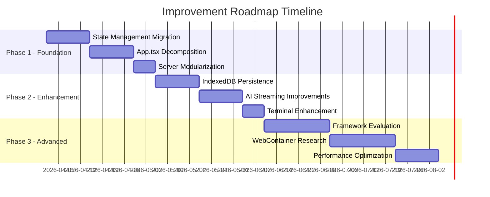

---

## Phase 1: Foundation

### 1.1 State Management Migration to Nanostores

**Objective:** Replace useState hooks and prop drilling with centralized, atomic state management.

#### Current State Analysis

The application currently uses:
- Multiple `useState` hooks in [`App.tsx`](src/App.tsx:65) (20+ state variables)
- Custom hooks: [`useFiles`](src/hooks/useFiles.ts:19), [`useChat`](src/hooks/useChat.ts:11), [`useAgent`](src/hooks/useAgent.ts:18), [`useGit`](src/hooks/useGit.ts)
- Prop drilling through component hierarchy
- No centralized state store

#### Target Architecture

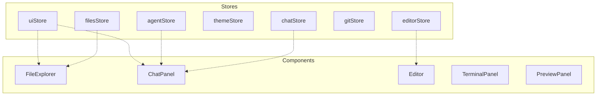

#### Implementation Tasks

| Task | Description | Files to Create/Modify |
|------|-------------|------------------------|
| 1.1.1 | Install Nanostores dependencies | `package.json` |
| 1.1.2 | Create filesStore | `src/stores/filesStore.ts` |
| 1.1.3 | Create chatStore | `src/stores/chatStore.ts` |
| 1.1.4 | Create editorStore | `src/stores/editorStore.ts` |
| 1.1.5 | Create themeStore | `src/stores/themeStore.ts` |
| 1.1.6 | Create agentStore | `src/stores/agentStore.ts` |
| 1.1.7 | Create uiStore | `src/stores/uiStore.ts` |
| 1.1.8 | Migrate useFiles to filesStore | `src/hooks/useFiles.ts` |
| 1.1.9 | Migrate useChat to chatStore | `src/hooks/useChat.ts` |
| 1.1.10 | Update App.tsx to use stores | `src/App.tsx` |
| 1.1.11 | Update components to subscribe to stores | All component files |
| 1.1.12 | Add store persistence | `src/stores/persistence.ts` |

#### Dependencies to Add

```json
{
  "dependencies": {
    "nanostores": "^0.10.0",
    "@nanostores/react": "^0.7.0"
  }
}
```

#### Store Architecture Example

```typescript
// src/stores/filesStore.ts
import { atom, map, computed } from 'nanostores';
import { persistentAtom } from './persistence';

export interface FileItem {
  id: string;
  name: string;
  content: string;
  language: string;
  path: string;
  isOpen?: boolean;
  isModified?: boolean;
}

// Atoms for primitive state
export const activeFileId = atom<string | null>(null);
export const openTabIds = atom<string[]>([]);

// Map for complex state
export const files = map<Record<string, FileItem>>({});

// Computed values
export const activeFile = computed(
  [files, activeFileId],
  ($files, $activeId) => $activeId ? $files[$activeId] : null
);

export const openFiles = computed(
  [files, openTabIds],
  ($files, $tabIds) => $tabIds.map(id => $files[id]).filter(Boolean)
);

// Actions
export function setActiveFile(id: string | null) {
  activeFileId.set(id);
}

export function openFile(id: string) {
  const current = openTabIds.get();
  if (!current.includes(id)) {
    openTabIds.set([...current, id]);
  }
  activeFileId.set(id);
}

export function closeFile(id: string) {
  const current = openTabIds.get();
  openTabIds.set(current.filter(tabId => tabId !== id));
  if (activeFileId.get() === id) {
    const remaining = openTabIds.get();
    activeFileId.set(remaining.length > 0 ? remaining[remaining.length - 1] : null);
  }
}
```

#### Migration Strategy

1. **Parallel Implementation**: Create stores alongside existing hooks
2. **Gradual Migration**: Migrate one feature area at a time
3. **Hook Wrappers**: Create hook wrappers around stores for backward compatibility
4. **Testing**: Add unit tests for each store before migration
5. **Rollback Plan**: Keep existing hooks until migration is verified

#### Testing Requirements

- [ ] Unit tests for each store
- [ ] Integration tests for store persistence
- [ ] Component tests with store subscriptions
- [ ] Performance benchmarks (render count comparison)

---

### 1.2 App.tsx Decomposition

**Objective:** Break down the monolithic [`App.tsx`](src/App.tsx:65) component into focused, maintainable components.

#### Current Responsibilities

The [`App.tsx`](src/App.tsx:65) component currently handles:

1. Layout management (left/right panel state)
2. File operations (CRUD, tabs, active file)
3. Chat integration (messages, AI responses)
4. Agent mode (planning, execution)
5. Git operations (status, commit, push)
6. Terminal management (WebSocket, output)
7. Theme management (apply, persist)
8. Keyboard shortcuts (global commands)
9. Preview panel (URL, port management)
10. Settings and modals state

#### Target Component Architecture

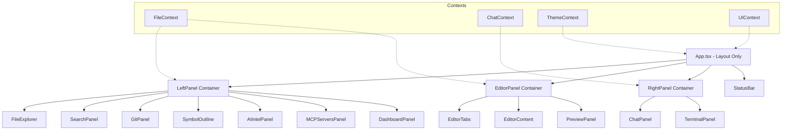

#### New Component Files to Create

| Component | Path | Responsibility |
|-----------|------|----------------|
| `LayoutContext` | `src/contexts/LayoutContext.tsx` | Panel state, sidebar visibility |
| `FileContext` | `src/contexts/FileContext.tsx` | File operations, tabs |
| `ChatContext` | `src/contexts/ChatContext.tsx` | Chat messages, AI interaction |
| `EditorPanel` | `src/components/EditorPanel.tsx` | Editor tabs and content |
| `LeftSidebar` | `src/components/LeftSidebar.tsx` | Activity bar and panel container |
| `RightSidebar` | `src/components/RightSidebar.tsx` | Chat and terminal container |
| `ActivityBar` | `src/components/ActivityBar.tsx` | Left icon navigation |
| `PanelManager` | `src/components/PanelManager.tsx` | Panel switching logic |
| `KeyboardShortcuts` | `src/components/KeyboardShortcuts.tsx` | Global keyboard handling |
| `ModalManager` | `src/components/ModalManager.tsx` | Settings, shortcuts, theme modals |

#### Implementation Tasks

| Task | Description | Dependencies |
|------|-------------|--------------|
| 1.2.1 | Create LayoutContext for panel state | None |
| 1.2.2 | Create FileContext wrapping filesStore | 1.1.2 (filesStore) |
| 1.2.3 | Create ChatContext wrapping chatStore | 1.1.3 (chatStore) |
| 1.2.4 | Extract ActivityBar component | 1.2.1 |
| 1.2.5 | Extract LeftSidebar component | 1.2.1, 1.2.4 |
| 1.2.6 | Extract EditorPanel component | 1.2.2 |
| 1.2.7 | Extract RightSidebar component | 1.2.1, 1.2.3 |
| 1.2.8 | Extract KeyboardShortcuts component | 1.2.1-1.2.3 |
| 1.2.9 | Extract ModalManager component | None |
| 1.2.10 | Refactor App.tsx to use new components | 1.2.1-1.2.9 |
| 1.2.11 | Add component tests | All components |

#### App.tsx Target Structure

```typescript
// src/App.tsx - Target structure
export default function App() {
  return (
    <ThemeProvider>
      <FileProvider>
        <ChatProvider>
          <LayoutProvider>
            <div className="app-container">
              <ActivityBar />
              <LeftSidebar />
              <EditorPanel />
              <RightSidebar />
              <StatusBar />
              <ModalManager />
              <KeyboardShortcuts />
            </div>
          </LayoutProvider>
        </ChatProvider>
      </FileProvider>
    </ThemeProvider>
  );
}
```

#### Testing Requirements

- [ ] Component tests for each new component
- [ ] Integration tests for context providers
- [ ] Visual regression tests for layout
- [ ] Accessibility tests for keyboard navigation

---

### 1.3 Server Route Modularization

**Objective:** Complete the migration of remaining routes from [`server.ts`](server.ts:1) to modular route files.

#### Current State

The [`server.ts`](server.ts:1) file contains:
- Express app setup
- Vite dev server integration
- WebSocket server for terminal
- Inline API routes
- Process management
- AI proxy endpoints

Some routes have already been extracted to:
- [`server/routes/files.ts`](server/routes/files.ts)
- [`server/routes/git.ts`](server/routes/git.ts)
- [`server/routes/ai.ts`](server/routes/ai.ts)

#### Target Architecture

```mermaid
graph TD
    Server[server.ts - Entry Point]
    
    Server --> App[Express App Setup]
    Server --> Vite[Vite Integration]
    Server --> WS[WebSocket Server]
    
    App --> MW[Middleware]
    App --> Routes[Route Modules]
    
    MW --> CORS[CORS Handler]
    MW --> RL[Rate Limiters]
    MW --> BP[Body Parser]
    
    Routes --> FR[/api/files routes]
    Routes --> GR[/api/git routes]
    Routes --> AR[/api/ai routes]
    Routes --> CR[/api/chat routes]
    Routes --> AR2[/api/agent routes]
    Routes --> PR[/api/preview routes]
    Routes --> TR[Terminal Routes]
    
    subgraph Services
        FS[FileService]
        GS[GitService]
        AS[AIService]
        PS[ProcessService]
    end
    
    FR --> FS
    GR --> GS
    AR --> AS
    AR2 --> AS
    TR --> PS
```

#### Files to Create/Modify

| File | Action | Description |
|------|--------|-------------|
| `server/routes/chat.ts` | Create | Chat streaming endpoints |
| `server/routes/agent.ts` | Create | Agent mode endpoints |
| `server/routes/preview.ts` | Create | Preview server endpoints |
| `server/routes/terminal.ts` | Create | Terminal WebSocket handling |
| `server/services/fileService.ts` | Create | File operations logic |
| `server/services/gitService.ts` | Create | Git operations logic |
| `server/services/processService.ts` | Create | Process management |
| `server/middleware/errorHandler.ts` | Create | Global error handling |
| `server/index.ts` | Create | Server entry point |
| `server.ts` | Modify | Reduce to minimal setup |

#### Implementation Tasks

| Task | Description | Dependencies |
|------|-------------|--------------|
| 1.3.1 | Create ProcessService for process management | None |
| 1.3.2 | Extract chat routes to `routes/chat.ts` | None |
| 1.3.3 | Extract agent routes to `routes/agent.ts` | 1.3.1 |
| 1.3.4 | Extract preview routes to `routes/preview.ts` | None |
| 1.3.5 | Create terminal WebSocket handler | 1.3.1 |
| 1.3.6 | Create error handling middleware | None |
| 1.3.7 | Refactor server.ts to use route modules | 1.3.1-1.3.6 |
| 1.3.8 | Add route-level tests | All routes |

#### Server Entry Point Target

```typescript
// server/index.ts - Target structure
import express from 'express';
import { createServer } from 'http';
import { setupVite } from './vite-setup';
import { setupWebSocket } from './websocket-setup';
import { errorHandler } from './middleware/errorHandler';
import { fileRoutes } from './routes/files';
import { gitRoutes } from './routes/git';
import { aiRoutes } from './routes/ai';
import { chatRoutes } from './routes/chat';
import { agentRoutes } from './routes/agent';
import { previewRoutes } from './routes/preview';

const app = express();
const server = createServer(app);

// Middleware
app.use(express.json());
app.use(rateLimiter);

// Routes
app.use('/api/files', fileRoutes);
app.use('/api/git', gitRoutes);
app.use('/api/ai', aiRoutes);
app.use('/api/chat', chatRoutes);
app.use('/api/agent', agentRoutes);
app.use('/api/preview', previewRoutes);

// Error handling
app.use(errorHandler);

// Setup
setupVite(app);
setupWebSocket(server);

export { app, server };
```

#### Testing Requirements

- [ ] Unit tests for each service
- [ ] Integration tests for each route
- [ ] WebSocket connection tests
- [ ] Error handling tests

---

## Phase 2: Enhancement

### 2.1 IndexedDB Persistence Implementation

**Objective:** Replace localStorage with IndexedDB for better storage capacity and async operations.

#### Current Limitations

- localStorage size limit: ~5-10MB
- Synchronous blocking operations
- No indexing for complex queries
- Chat history can grow large

#### Target Architecture

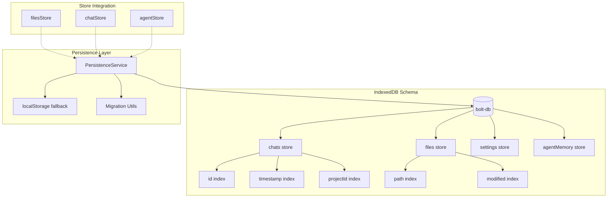

#### Implementation Tasks

| Task | Description | Dependencies |
|------|-------------|--------------|
| 2.1.1 | Install Dexie.js for IndexedDB wrapper | None |
| 2.1.2 | Create database schema | 2.1.1 |
| 2.1.3 | Create PersistenceService | 2.1.2 |
| 2.1.4 | Implement chat history storage | 2.1.3 |
| 2.1.5 | Implement file cache storage | 2.1.3 |
| 2.1.6 | Implement settings storage | 2.1.3 |
| 2.1.7 | Create migration utilities | 2.1.3 |
| 2.1.8 | Add localStorage fallback | 2.1.3 |
| 2.1.9 | Integrate with stores | 1.1.x, 2.1.4-2.1.6 |
| 2.1.10 | Add export/import functionality | 2.1.3 |

#### Dependencies to Add

```json
{
  "dependencies": {
    "dexie": "^4.0.0",
    "dexie-react-hooks": "^1.1.7"
  }
}
```

#### Database Schema

```typescript
// src/lib/db.ts
import Dexie, { Table } from 'dexie';

export interface ChatMessage {
  id: string;
  projectId: string;
  role: 'user' | 'assistant' | 'system';
  content: string;
  timestamp: number;
  metadata?: Record<string, unknown>;
}

export interface StoredFile {
  path: string;
  content: string;
  language: string;
  modified: number;
  created: number;
}

export interface AgentMemory {
  id: string;
  projectId: string;
  memory: string;
  updatedAt: number;
}

export class AIStudioDB extends Dexie {
  chats!: Table<ChatMessage>;
  files!: Table<StoredFile>;
  settings!: Table<{ key: string; value: unknown }>;
  agentMemory!: Table<AgentMemory>;

  constructor() {
    super('ai-studio-db');
    this.version(1).stores({
      chats: 'id, projectId, timestamp',
      files: 'path, modified',
      settings: 'key',
      agentMemory: 'id, projectId'
    });
  }
}

export const db = new AIStudioDB();
```

#### Testing Requirements

- [ ] Database schema tests
- [ ] CRUD operation tests
- [ ] Migration tests from localStorage
- [ ] Performance tests with large datasets
- [ ] Storage quota handling tests

---

### 2.2 AI Streaming Improvements

**Objective:** Enhance AI integration with better streaming, parsing, and multi-provider support.

#### Current State

- SSE streaming via `/api/chat` endpoint
- Regex-based code block parsing
- Single AI provider (Alibaba Qwen)
- Basic error handling

#### Target Improvements

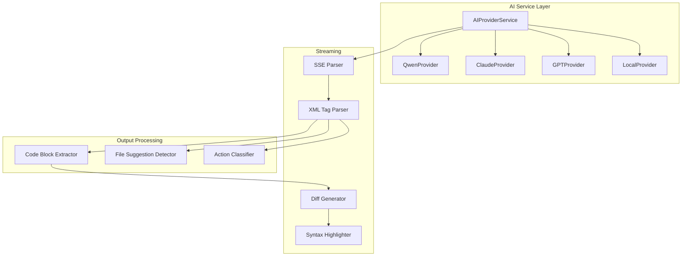

#### Implementation Tasks

| Task | Description | Dependencies |
|------|-------------|--------------|
| 2.2.1 | Create AIProviderService abstraction | None |
| 2.2.2 | Implement XML tag parser for AI output | None |
| 2.2.3 | Add diff visualization component | 2.2.2 |
| 2.2.4 | Create streaming code highlighter | None |
| 2.2.5 | Add multi-provider support | 2.2.1 |
| 2.2.6 | Implement action classifier | 2.2.2 |
| 2.2.7 | Add file suggestion detector | 2.2.2 |
| 2.2.8 | Create provider configuration UI | 2.2.5 |

#### XML Tag Parser Example

```typescript
// src/lib/ai-parser.ts
interface AIAction {
  type: 'file_create' | 'file_edit' | 'file_delete' | 'command' | 'text';
  path?: string;
  content?: string;
  command?: string;
}

export function parseAIOutput(output: string): AIAction[] {
  const actions: AIAction[] = [];
  
  // Match XML-like tags
  const tagRegex = /<(file|action|command)([^>]*)>([\s\S]*?)<\/\1>/g;
  let match;
  
  while ((match = tagRegex.exec(output)) !== null) {
    const [, tagType, attributes, content] = match;
    
    switch (tagType) {
      case 'file':
        const pathMatch = attributes.match(/path="([^"]+)"/);
        const actionMatch = attributes.match(/action="([^"]+)"/);
        if (pathMatch) {
          actions.push({
            type: actionMatch?.[1] === 'edit' ? 'file_edit' : 'file_create',
            path: pathMatch[1],
            content: content.trim()
          });
        }
        break;
      case 'command':
        actions.push({
          type: 'command',
          command: content.trim()
        });
        break;
    }
  }
  
  // Extract remaining text
  const textContent = output.replace(tagRegex, '').trim();
  if (textContent) {
    actions.push({ type: 'text', content: textContent });
  }
  
  return actions;
}
```

#### Testing Requirements

- [ ] Parser unit tests with various AI outputs
- [ ] Streaming integration tests
- [ ] Multi-provider configuration tests
- [ ] Error handling tests for malformed output

---

### 2.3 Terminal Integration Enhancement

**Objective:** Improve terminal UX with better process management, multi-session support, and command history.

#### Current State

- WebSocket-based terminal via xterm.js
- Single terminal session
- Basic command execution
- Server-side process spawning

#### Target Features

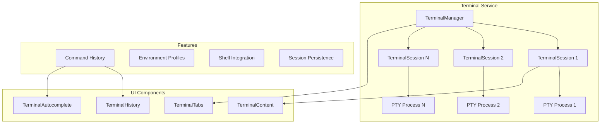

#### Implementation Tasks

| Task | Description | Dependencies |
|------|-------------|--------------|
| 2.3.1 | Create TerminalManager service | None |
| 2.3.2 | Implement multi-session support | 2.3.1 |
| 2.3.3 | Add terminal tabs UI | 2.3.2 |
| 2.3.4 | Implement command history | None |
| 2.3.5 | Add command autocomplete | 2.3.4 |
| 2.3.6 | Create environment profiles | None |
| 2.3.7 | Add session persistence | 2.1.x (IndexedDB) |
| 2.3.8 | Improve shell integration | None |

#### Testing Requirements

- [ ] Multi-session tests
- [ ] Command history persistence tests
- [ ] Shell integration tests (bash, zsh, cmd, powershell)
- [ ] Session recovery tests

---

## Phase 3: Advanced

### 3.1 Framework Migration Evaluation

**Objective:** Evaluate the feasibility and benefits of migrating from Vite + Express to Remix.

#### Current Stack

- **Frontend:** React 19 + Vite 6.2
- **Backend:** Express.js 4.21
- **Build:** Vite (SPA mode)
- **Deployment:** Node.js server

#### Remix Benefits

| Feature | Current | Remix |
|---------|---------|-------|
| SSR | No | Yes |
| Data Loading | Client-side | Loaders/Actions |
| API Routes | Express routes | File-based API |
| Streaming | Manual SSE | Built-in |
| Edge Deployment | No | Yes (Cloudflare) |
| Form Handling | Client | Progressive Enhancement |

#### Migration Considerations

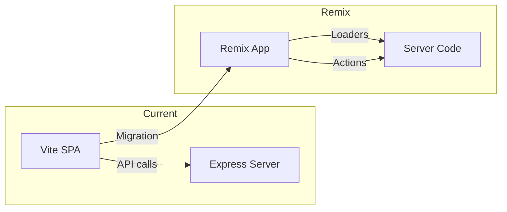

#### Evaluation Tasks

| Task | Description | Output |
|------|-------------|--------|
| 3.1.1 | Create Remix proof-of-concept | POC repository |
| 3.1.2 | Assess route migration complexity | Migration matrix |
| 3.1.3 | Evaluate WebSocket support | Technical report |
| 3.1.4 | Test Cloudflare deployment | Deployment guide |
| 3.1.5 | Performance comparison | Benchmark report |
| 3.1.6 | Create migration plan | Detailed migration guide |

#### Decision Criteria

- **Proceed if:**
  - SSR provides measurable UX improvement
  - Edge deployment reduces latency significantly
  - Migration effort < 4 weeks
  - WebSocket support is viable

- **Defer if:**
  - Migration breaks existing features
  - Performance gains are marginal
  - Team learning curve is steep
  - WebSocket limitations are blocking

---

### 3.2 WebContainer Integration Research

**Objective:** Research the feasibility of using WebContainer API for browser-based code execution.

#### Current Execution Model

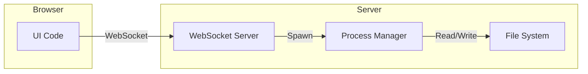

#### WebContainer Model

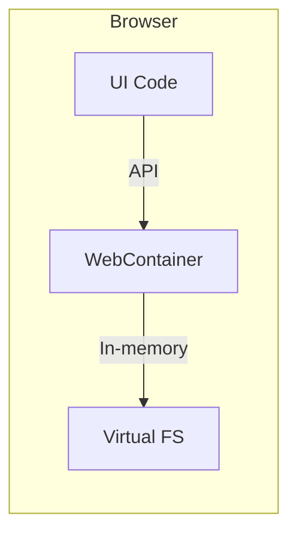

#### Requirements for WebContainer

| Requirement | Status | Notes |
|-------------|--------|-------|
| HTTPS | Required | Production ready |
| SharedArrayBuffer | Required | Cross-Origin-Isolation headers |
| Browser Support | Limited | Chrome/Edge only |
| Node.js Compatibility | Partial | Not all packages work |
| File System | Virtual | No direct disk access |

#### Research Tasks

| Task | Description | Output |
|------|-------------|--------|
| 3.2.1 | Create WebContainer POC | POC repository |
| 3.2.2 | Test project compatibility | Compatibility matrix |
| 3.2.3 | Assess deployment requirements | Infrastructure report |
| 3.2.4 | Evaluate security implications | Security assessment |
| 3.2.5 | Performance benchmarking | Performance report |
| 3.2.6 | Create hybrid architecture proposal | Architecture document |

#### Hybrid Architecture Proposal

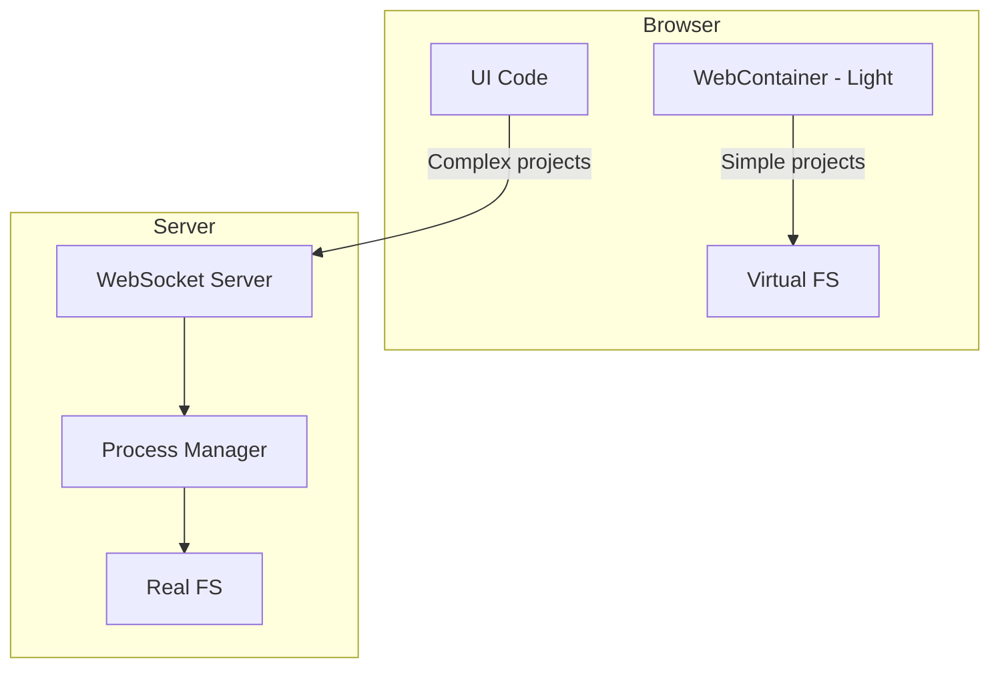

---

### 3.3 Performance Optimization

**Objective:** Optimize application performance for better user experience.

#### Performance Metrics

| Metric | Current Target | Goal |
|--------|---------------|------|
| First Contentful Paint | < 1.5s | < 1s |
| Time to Interactive | < 3s | < 2s |
| Bundle Size (gzipped) | ~500KB | < 300KB |
| Editor Input Latency | < 16ms | < 10ms |
| Chat Response Start | < 500ms | < 200ms |

#### Optimization Areas

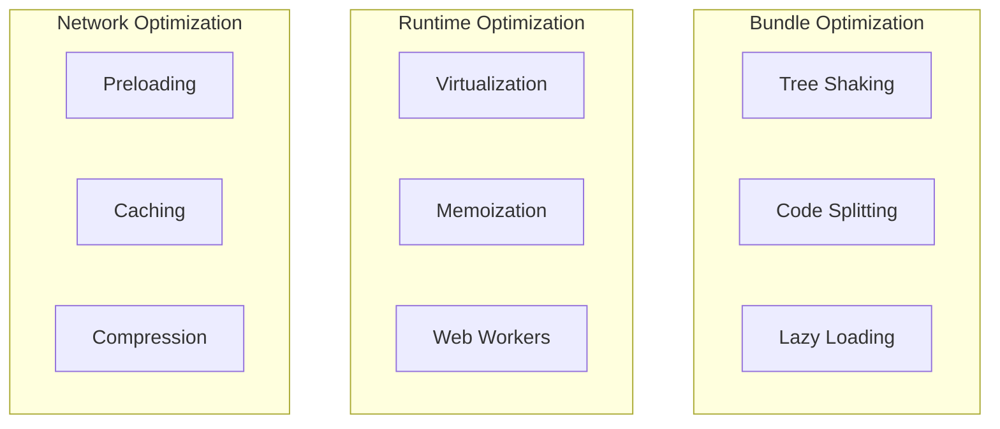

#### Implementation Tasks

| Task | Description | Dependencies |
|------|-------------|--------------|
| 3.3.1 | Analyze bundle with Rollup Visualizer | None |
| 3.3.2 | Implement route-based code splitting | 1.2.x |
| 3.3.3 | Add component lazy loading | 1.2.x |
| 3.3.4 | Virtualize file tree for large projects | None |
| 3.3.5 | Optimize re-renders with memoization | 1.1.x |
| 3.3.6 | Move AI parsing to Web Worker | 2.2.x |
| 3.3.7 | Implement service worker caching | None |
| 3.3.8 | Add resource preloading hints | None |

#### Testing Requirements

- [ ] Lighthouse CI integration
- [ ] Bundle size monitoring
- [ ] Runtime performance profiling
- [ ] Memory leak detection

---

## Risk Assessment

### High-Risk Items

| Risk | Impact | Probability | Mitigation |
|------|--------|-------------|------------|
| State migration breaks existing features | High | Medium | Parallel implementation, comprehensive tests |
| IndexedDB browser compatibility issues | Medium | Low | localStorage fallback, feature detection |
| WebContainer browser support limitations | High | High | Hybrid architecture, feature flags |
| Remix migration complexity underestimated | High | Medium | POC first, incremental migration |

### Medium-Risk Items

| Risk | Impact | Probability | Mitigation |
|------|--------|-------------|------------|
| Performance regression during refactoring | Medium | Medium | Performance benchmarks, monitoring |
| Team learning curve for new technologies | Medium | Medium | Documentation, training |
| Dependency conflicts with new packages | Low | Medium | Version pinning, lock files |

### Rollback Plans

#### State Management Rollback

1. Keep existing hooks as wrappers around stores
2. Feature flag to switch between implementations
3. Revert to hooks if issues detected

#### IndexedDB Rollback

1. Maintain localStorage as fallback
2. Migration utility to export/import data
3. Feature detection for IndexedDB support

#### Framework Migration Rollback

1. Keep Express server as separate process
2. Deploy Remix alongside existing app
3. Gradual traffic migration with feature flags

---

## Success Metrics

### Code Quality Indicators

| Metric | Current | Target | Measurement |
|--------|---------|--------|-------------|
| App.tsx lines | ~900 | < 200 | Line count |
| Cyclomatic complexity | High | Low | ESLint complexity rule |
| Test coverage | ~40% | > 80% | Vitest coverage |
| TypeScript strict mode | Partial | Full | tsc --noEmit |
| Lint errors | Unknown | 0 | ESLint |

### Performance Benchmarks

| Metric | Current | Target | Measurement Tool |
|--------|---------|--------|------------------|
| FCP | ~1.5s | < 1s | Lighthouse |
| TTI | ~3s | < 2s | Lighthouse |
| Bundle size | ~500KB | < 300KB | Build analysis |
| Chat latency | ~500ms | < 200ms | Custom metrics |
| File open time | ~100ms | < 50ms | Custom metrics |

### User Experience Metrics

| Metric | Target | Measurement |
|--------|--------|-------------|
| Chat history load time | < 500ms | IndexedDB query time |
| Terminal session start | < 200ms | WebSocket connection time |
| File tree render (1000 files) | < 100ms | React DevTools Profiler |
| Theme switch | < 50ms | CSS variable update time |

### Architecture Metrics

| Metric | Current | Target |
|--------|---------|--------|
| Components with > 500 lines | 5+ | 0 |
| Prop drilling depth | 4+ levels | 2 levels |
| Store count | 0 | 6 |
| Route modules | 3 | 7 |

---

## Implementation Timeline

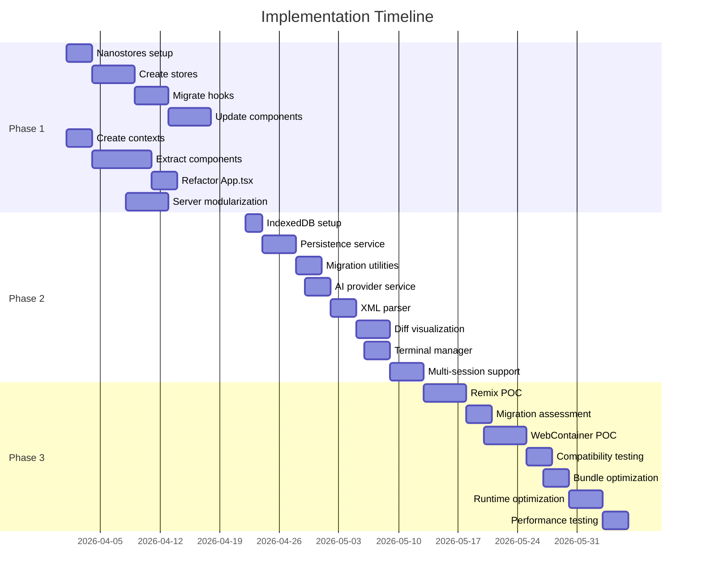

---

## Dependencies Between Phases

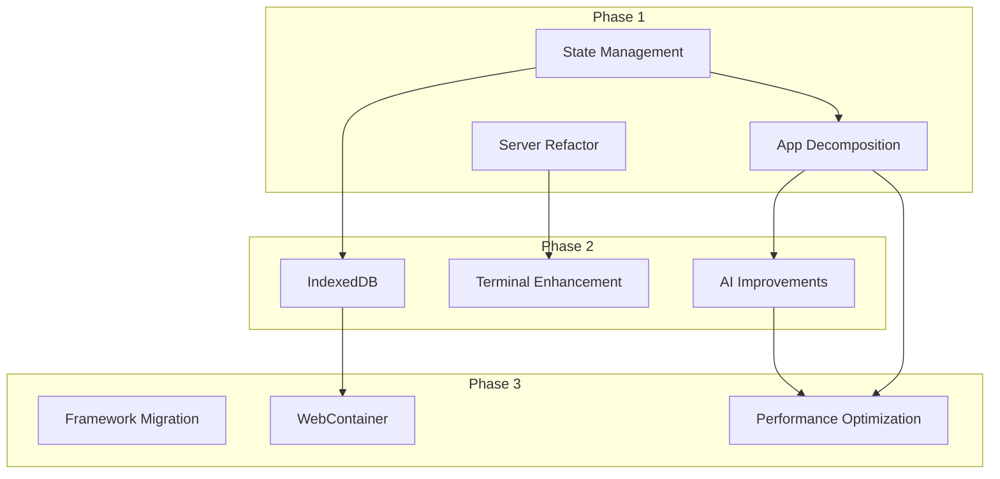

---

## Appendix A: File Structure After Phase 1

```
src/
├── App.tsx                    # Simplified layout component (~150 lines)
├── contexts/
│   ├── LayoutContext.tsx      # Panel state management
│   ├── FileContext.tsx        # File operations context
│   └── ChatContext.tsx        # Chat state context
├── stores/
│   ├── filesStore.ts          # File state atoms
│   ├── chatStore.ts           # Chat state atoms
│   ├── editorStore.ts         # Editor state atoms
│   ├── themeStore.ts          # Theme preferences
│   ├── agentStore.ts          # Agent mode state
│   └── uiStore.ts             # UI state atoms
├── components/
│   ├── layout/
│   │   ├── ActivityBar.tsx
│   │   ├── LeftSidebar.tsx
│   │   ├── RightSidebar.tsx
│   │   └── StatusBar.tsx
│   ├── editor/
│   │   ├── EditorPanel.tsx
│   │   ├── EditorTabs.tsx
│   │   └── EditorContent.tsx
│   └── ... (existing components)
├── lib/
│   ├── db.ts                  # IndexedDB setup
│   ├── ai-parser.ts           # AI output parsing
│   └── persistence.ts         # Storage utilities
└── ... (existing files)

server/
├── index.ts                   # Server entry point
├── routes/
│   ├── files.ts              # File operations
│   ├── git.ts                # Git operations
│   ├── ai.ts                 # AI endpoints
│   ├── chat.ts               # Chat streaming
│   ├── agent.ts              # Agent mode
│   ├── preview.ts            # Preview server
│   └── terminal.ts           # Terminal WebSocket
├── services/
│   ├── fileService.ts
│   ├── gitService.ts
│   ├── aiService.ts
│   └── processService.ts
└── middleware/
    ├── errorHandler.ts
    └── rateLimiter.ts
```

---

## Appendix B: Testing Strategy

### Unit Tests

- Store operations (CRUD, computed values)
- Context providers (state updates, actions)
- Utility functions (parsing, formatting)
- Service methods (API calls, transformations)

### Integration Tests

- Component + store integration
- Context + hook integration
- Route + service integration
- WebSocket + terminal integration

### E2E Tests

- User workflows (create file, edit, save)
- Chat interactions (send message, receive response)
- Terminal operations (execute command, see output)
- Git operations (commit, push)

### Performance Tests

- Bundle size monitoring
- Runtime performance profiling
- Memory leak detection
- Load testing for concurrent users

---

*Roadmap Version: 1.0*
*Created: 2026-03-24*
*Based on: Architecture Comparison Report (plans/architecture-comparison-report.md)*